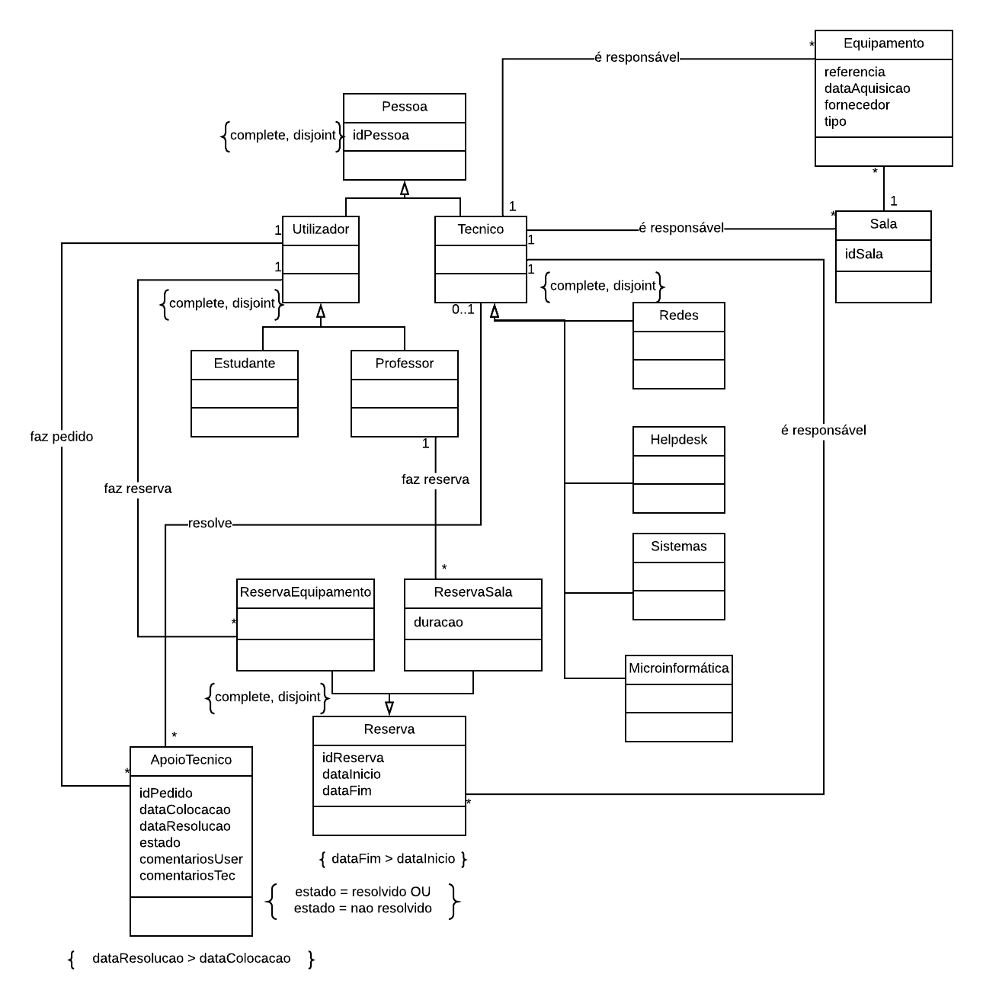

# Exame 2015

[LINK](https://drive.google.com/drive/folders/1pRY_-TelR-OAI_EhisI2siXExDWv9j4G)

***1. No diagrama de classes UML uma classe é:***

**Classe**: descritor de um conjunto de objetos que partilham as mesmas propriedades (semântica, atributos e relações).

**R.: E**

***2. ANULADA***

***3. Diga em que forma normal se encontra o esquema relacional R(A,B,C,D,E) sabendo que contem a seguintes dependências funcionais DF={A->C; AB->DE} e que os atributos são atómicos, i.e., têm domínios singulares.***

1NF > 2NF > 3NF > BCNF > 4NF

+ **1NF**: cada célula na relação tem que ser atómica
+ **2NF**: 1NF e nenhum atributo não primo é funcionalmente dedpendente de um subconjunto de uma chave candidata
+ **BCNF**: para cada DF não trivial o lado esquerdo é uma (super)key
+ **3NF**: para cada DF não trivial , o lado esquerdo é uma chave ou o lado direito tem apenas atributos primos.

**Atributo Primo**: atributo que é membro de alguma chave

Como não se verifica 2NF, o esquema relacional encontra-se na 1NF

**R.: C**

***4. Qual o melhor modo de mapear em LDD-SQL o seguinte diagrama de classes UML***

Pessoas têm 0 ou 1 sócios, sócios estão associados obrigatoriamente a uma pessoa -> Sócio tem de referenciar Pessoa. 

````sql
CREATE TABLE Pessoa (
    idPessoa INTEGER PRIMARY KEY AUTOINCREMENT, 
    nome TEXT, NIF TEXT, 
    morada TEXT);
CREATE TABLE Socio (
    idSocio INTEGER PRIMARY KEY AUTOINCREMENT, 
    nrSocio INTEGER, 
    dataNasc DATE, 
    morada TEXT, 
    idPessoa INTEGER REFERENCES Pessoa(idPessoa));
````

**R.: B**

***5. Qual a expressão em álgebra relacional equivalente à seguinte consulta SQL:***
````sql
SELECT a,b FROM T1 NATURAL JOIN (SELECT * FROM T2 WHERE  c='Ola');
````

Π - seleciona colunas de uma tabela

⋈ - operador de Natural Join

σ - retorna tuplos que satisfazem uma condição

Π(a,b) (T1 ⋈ σ(c='Ola')(T2));

**R.: B**

***6. Os triggers do tipo ````INSTEAD OF```` são normalmente usados com:***

Os ````INSTEAD OF```` *triggers* são usados para modificar *views*, mais precisamente para reescrever processos especificados explicitamente pelo criador da *view*.

**R.: B**

***7. Nas linguagens PSM um cursor serve para:***

O SQL/PSM (SQL/Persistent Stored Modules) é uma extensão ao SQL que define um standard para a escrita de procedimentos e funções em SQL que juntamente com a utilização de estruturas de controle aumentam consideravelmente o poder expressivo do SQL.

Os **cursores** são necessários quando um comando SQL devolve mais do que um tuplo como resultado.

**R.: E** *acho que não demos isto*

***8. Os sistemas de controlo de concorrência por bloqueios caracterizam-se por:***

Serem menos suscetíveis de abortarem transações que os sistemas baseados em marcas temporais

**R.: E** *acho que não demos isto*


***9. O teorema CAP diz-nos que é impossível a um sistema distribuído garantir simultaneamente as seguintes
características:***

O teorema CAP diz-nos que é impossível a um sistema distribuído garantir simultaneamente:
+ **Consistência** - todos os nós verem a mesma data ao mesmo tempo
+ **Disponibilidade** - garante que todos os pedidos têm uma resposta que indica o sucesso ou a falha
+ **Tolerância particional** - o sistema continuam a trabalhar mesmo nós desapareçam ou sejam adicionados

**R.: B**

***10. O esquema em estrela de um armazém de dados caracteriza-se por:***

O **esquema de estrela** é uma abordagem de modelação avançada adotada amplamente pelos armazéns de dados relacionais. Requer que os modeladores classifiquem as respetivas tabelas de modelos como *dimensão* ou facto.

**R.: D** *acho que não demos isto*

***11. Considere o esquema relacional R(A,B,C,D,E,F) com as seguinte dependências funcionais:***
+ ***A -> B;***
+ ***B -> CD;*** 
+ ***AD -> E.*** 
  
***Obtenha justificando uma decomposição na 3NF***

**Chave candidata**: {A,F}, pois partindo deste conjunto é possível obter todos os atributos da relação.

**1. Encontrar base mínima**
+ A->B
+ B->C
+ B->D
+ AD->E

**2. Verificar DFs redundantes**
+ A: A -> não contém B, logo é essencial
+ B: B -> não contém C nem D, logo são essenciais
+ AD: A, B, C, D -> não contém E, logo é essencial

**3. Verificar atributos redundantes**

Apenas testar AD->E
 
Como A->D (A->B e B->D) e não D->A, remove-se D->E e fica A->E

+ A->B
+ B->C
+ B->D
+ A->E

**4. Relações 3NF**
+ R1(A,B,E)
+ R2(B,C,D)
+ R3(A,F) - adicionada porque nenhuma das relações anteriores contêm a chave candidata 

Chaves: {A,F}

***12. Verifique se as diferentes relações que obteve na decomposição se encontram na forma normal de Boyce-Codd. Justifique.***

+ R1(A,B,E)
+ R2(B,C,D)
+ R3(A,F)

- **BCNF**: para cada DF não trivial o lado esquerdo é uma (super)key

**R(A,B,E)**
+ A->B
+ A->E

Como A é super chave da respetiva relação, não viola a BCNF

**R(B,C,D)**
+ B->C
+ B->D

Como B é super chave da respetiva relação, não viola a BCNF

**R(A,F)**
+ A->F

Como B é super chave da respetiva relação, não viola a BCNF

***13. Construa um modelo concetual de dados em UML para armazenar a informação mantida pelo Serviço de Informática de uma Faculdade. Indique todas as restrições que possam ser úteis para a construção da base de dados.***

***Os responsáveis pela gestão do serviço de informática de uma faculdade pretendem manter informação sobre os equipamentos e salas que gerem, as reservas realizadas por utilizadores, o pessoal técnico do serviço, e os pedidos de apoio técnico. O sistema deve permitir registar os detalhes de cada equipamento, nomeadamente a referência, data de aquisição, fornecedor, tipo, entre outros. Cada equipamento pode estar associado a uma sala. Os equipamentos e salas devem ter um técnico responsável associado. Os equipamentos podem ser reservados por estudantes ou professores mas as salas apenas podem ser reservadas por professores. Cada reserva tem sempre associado um técnico responsável, bem como uma data de início e uma data de fim. No caso das salas, regista-se a duração da reserva em horas. Os técnicos do serviço estão organizados em unidades, nomeadamente: helpdesk, redes, sistemas e microinformática. Os pedidos de apoio técnico podem ser solicitados por qualquer utilizador, estudante ou professor, e são posteriormente associados a um técnico para resolução. Relativamente aos pedidos, importa registar a data de colocação do pedido, a data de resolução, o estado (resolvido ou não), os comentários do utilizador que colocou o pedido, e os comentários do técnico.***




